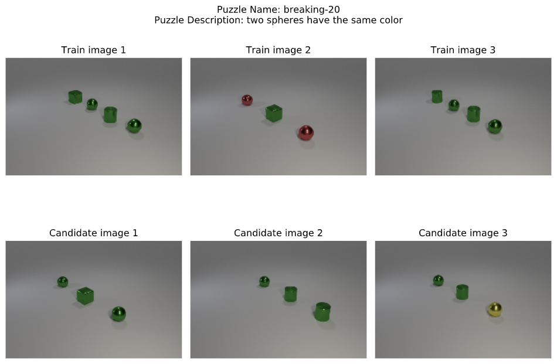

# Installation instruction
1. Clone this repository.
    ```bash
    $ git clone https://github.com/anonymousocean/vdpicml2021.git
    ```
2. Go into the project directory and install the requirements for the solver.
    ```bash
    $ pip install -r requirements.txt
    ```
3. To run the symbolic solver on a particular puzzle use the following command
    ```bash
     $ python scripts/vdpsolve.py /path/to/puzzle/folder - solver_options
    ```

4.  The solver options can be retrieved using `-h` in the solver options.
    ```bash
     $ python scripts/vdpsolve.py /path/to/puzzle/folder - -h
    ```

## Understanding the output of `vdpsolve.py`

Let us take the example of the following puzzle:


The solver yields the following concept for this puzzle.
```plaintext
   "Exists q0: sphere!0. Exists q1: sphere!1. And(same_color!0!1 same_color!1!0)"
```
This concept can be interpreted as:
```plaintext
   "Exists x: sphere. Exists y: sphere. And(same_color(x, y), same_color(y, x))"
```


